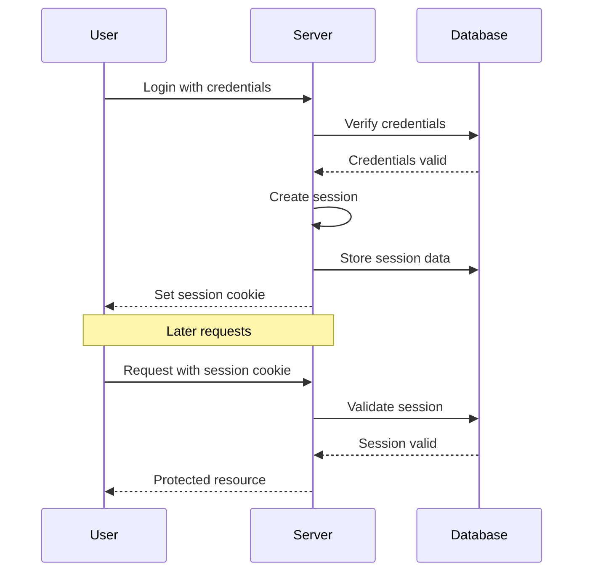
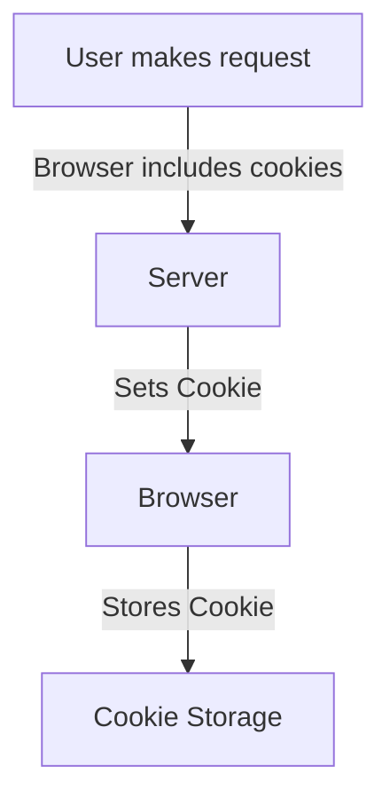
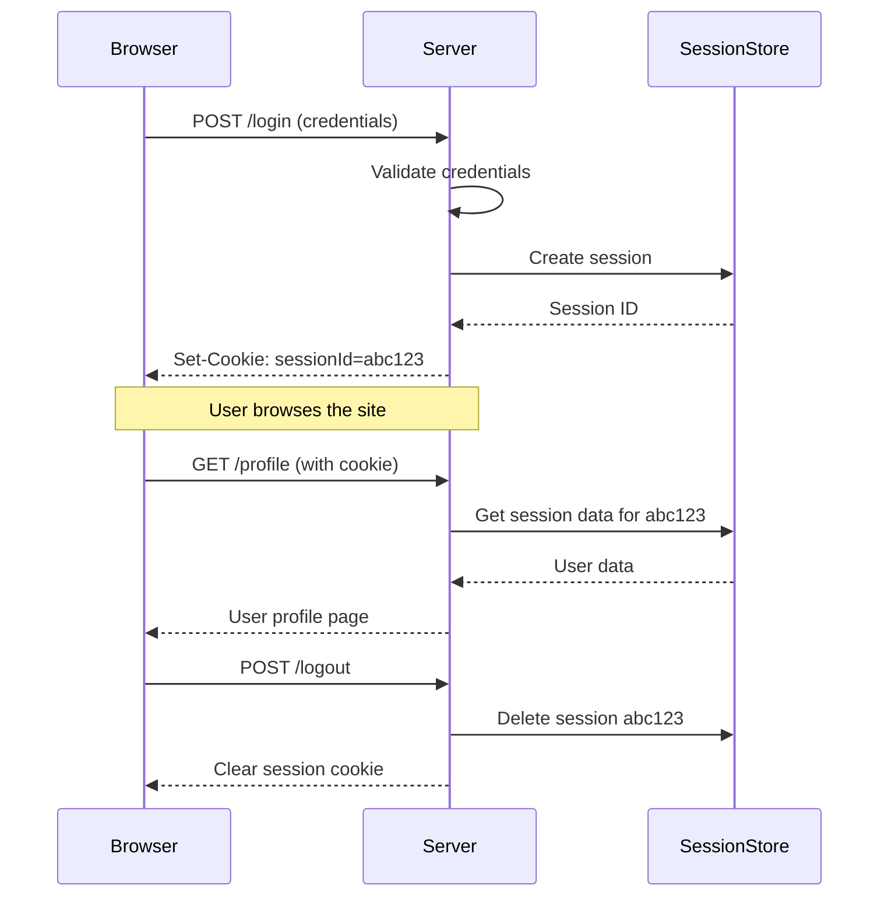
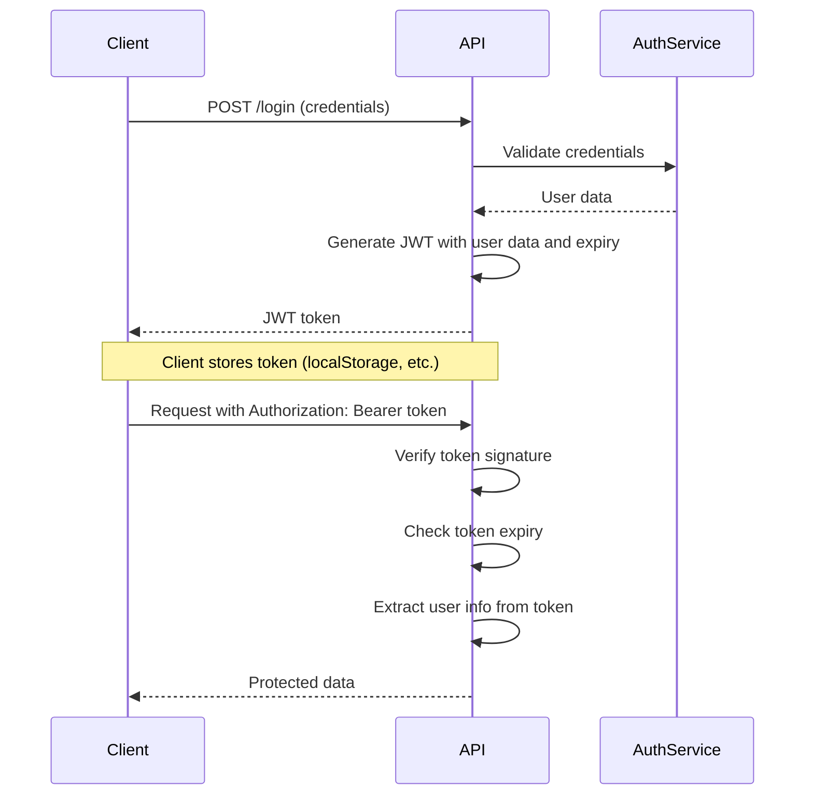
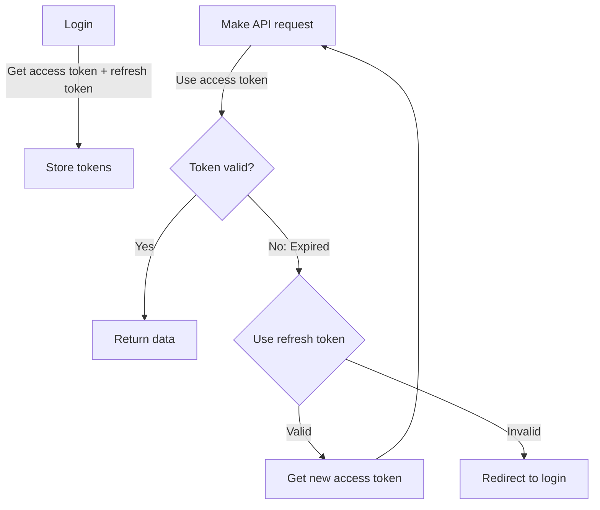

# 🔐 Web Authentication Guide


## Table of Contents
- [JWT Tokens vs Sessions](#jwt-tokens-vs-sessions)
- [Sessions in Node.js](#sessions-in-nodejs)
- [Session Authentication](#session-authentication)
- [Cookies](#cookies)
- [Browser Storage](#browser-storage)
- [Token-based Authentication](#token-based-authentication)
- [How Sessions Work on the Web](#how-sessions-work-on-the-web)
- [Token Authentication in Web APIs](#token-authentication-in-web-apis)

## JWT Tokens vs Sessions

### Real-Life Analogy

**Sessions are like hotel room keys** 🔑
- When you check in, you get a key card
- The hotel maintains a record of your stay
- The key just has an ID that refers to their system
- If you lose the key, hotel staff can verify your identity and issue a new one
- When you check out, the key becomes invalid

**JWT tokens are like event wristbands** 🎭
- The wristband contains all your access information
- Security can check your band without calling the main office
- The band is self-contained with your access level and validity period
- If someone copies your wristband exactly, they can also enter

### Technical Comparison

| Feature | Sessions | JWT Tokens |
|---------|----------|------------|
| Storage | Server-side | Client-side |
| Scalability | Requires shared storage | Stateless, easily scalable |
| Security | Server controls session | Can't revoke individual tokens easily |
| Size | Small cookie/token | Larger token size |
| Expiration | Server can invalidate anytime | Valid until expiration |

## Sessions in Node.js

Node.js provides several ways to implement sessions:

### Using express-session

```javascript
const express = require('express');
const session = require('express-session');
const app = express();

app.use(session({
  secret: 'your-secret-key',
  resave: false,
  saveUninitialized: false,
  cookie: { 
    secure: process.env.NODE_ENV === 'production', 
    maxAge: 24 * 60 * 60 * 1000 // 24 hours
  }
}));

app.get('/login', (req, res) => {
  // After authentication
  req.session.userId = user.id;
  req.session.isAuthenticated = true;
  res.redirect('/dashboard');
});

app.get('/logout', (req, res) => {
  req.session.destroy();
  res.redirect('/');
});

app.get('/dashboard', (req, res) => {
  if (!req.session.isAuthenticated) {
    return res.redirect('/login');
  }
  // Render dashboard
});
```

### Session Stores

By default, `express-session` uses in-memory storage, but for production, you should use:

- **Redis**: Fast, in-memory database
- **MongoDB**: Document database with persistence
- **PostgreSQL/MySQL**: SQL databases

Example with Redis:

```javascript
const session = require('express-session');
const RedisStore = require('connect-redis')(session);
const { createClient } = require('redis');

const redisClient = createClient({ url: process.env.REDIS_URL });
redisClient.connect().catch(console.error);

app.use(session({
  store: new RedisStore({ client: redisClient }),
  secret: 'your-secret-key',
  resave: false,
  saveUninitialized: false
}));
```

## Session Authentication

Session authentication follows these steps:



### Key Components

1. **Authentication**: Verifying user identity
2. **Session Creation**: Generating a unique session ID
3. **Session Storage**: Keeping session data on the server
4. **Session Cookie**: Storing session ID on the client
5. **Session Validation**: Checking session validity on each request

## Cookies

Cookies are small pieces of data stored in the browser that are sent with every request to the server.

### Types of Cookies

1. **Session Cookies**: Temporary, deleted when browser closes
2. **Persistent Cookies**: Have an expiration date, stored until then
3. **Secure Cookies**: Only sent over HTTPS
4. **HttpOnly Cookies**: Inaccessible to JavaScript (protection against XSS)
5. **SameSite Cookies**: Controls when cookies are sent with cross-site requests
   - **Lax**: Sent with navigation to the origin site
   - **Strict**: Only sent to the originating site
   - **None**: Sent on all requests (requires Secure flag)

### Cookie Flow



### Setting Cookies in Express

```javascript
// Setting a cookie
app.get('/set-cookie', (req, res) => {
  res.cookie('user', 'john', { 
    maxAge: 900000, 
    httpOnly: true,
    secure: true,
    sameSite: 'strict'
  });
  res.send('Cookie set');
});

// Reading a cookie
app.get('/get-cookie', (req, res) => {
  const userCookie = req.cookies.user;
  res.send(`User from cookie: ${userCookie}`);
});

// Clearing a cookie
app.get('/clear-cookie', (req, res) => {
  res.clearCookie('user');
  res.send('Cookie cleared');
});
```

## Browser Storage

Browsers provide several storage mechanisms:

### Local Storage

- Persists until explicitly cleared
- ~5MB storage limit
- Accessible via JavaScript
- Same-origin policy
- Synchronous API

```javascript
// Store data
localStorage.setItem('user', JSON.stringify({ id: 1, name: 'John' }));

// Retrieve data
const user = JSON.parse(localStorage.getItem('user'));

// Remove data
localStorage.removeItem('user');

// Clear all data
localStorage.clear();
```

### Session Storage

- Cleared when page session ends
- ~5MB storage limit
- Separate storage per tab/window
- Lost when tab/window closes

```javascript
// Same API as localStorage
sessionStorage.setItem('tempData', data);
```

### IndexedDB

- Large, structured data storage
- Asynchronous API
- Suitable for complex applications
- Higher storage limits (generally >250MB)

### Storage Comparison

| Feature | Cookies | Local Storage | Session Storage | IndexedDB |
|---------|---------|---------------|----------------|-----------|
| Capacity | ~4KB | ~5MB | ~5MB | >250MB |
| Expires | Custom | Never | Tab close | Never |
| Storage location | Client & Server | Client only | Client only | Client only |
| Sent with requests | Yes | No | No | No |
| API | Simple | Simple | Simple | Complex |
| Accessibility | Any window | Any window | Same tab | Any window |

## Token-based Authentication

Token-based authentication uses encoded tokens that contain authentication information.

### JWT Structure

A JWT consists of three parts separated by dots:

```
header.payload.signature
```

1. **Header**: Contains token type and algorithm
2. **Payload**: Contains claims (user data)
3. **Signature**: Verifies the token hasn't been tampered with

### Implementation in Node.js

```javascript
const express = require('express');
const jwt = require('jsonwebtoken');
const app = express();

app.use(express.json());

// Login and token generation
app.post('/login', (req, res) => {
  // Verify credentials
  const user = { id: 123, username: 'john' };
  
  const token = jwt.sign(
    { userId: user.id, username: user.username },
    'your-secret-key',
    { expiresIn: '1h' }
  );
  
  res.json({ token });
});

// Protected route
app.get('/protected', verifyToken, (req, res) => {
  res.json({ data: 'Protected data', user: req.user });
});

// Middleware to verify token
function verifyToken(req, res, next) {
  const bearerHeader = req.headers['authorization'];
  
  if (!bearerHeader) {
    return res.status(401).json({ error: 'Access denied' });
  }
  
  const token = bearerHeader.split(' ')[1];
  
  try {
    const decoded = jwt.verify(token, 'your-secret-key');
    req.user = decoded;
    next();
  } catch (error) {
    res.status(400).json({ error: 'Invalid token' });
  }
}
```

## How Sessions Work on the Web

Sessions enable the web server to maintain state across multiple requests from the same user.

### Session Flow



### Session Security Considerations

1. **Session Hijacking**: Stealing session ID to impersonate users
   - Prevention: HTTPS, secure/HttpOnly cookies
   
2. **Session Fixation**: Forcing a user to use a known session ID
   - Prevention: Regenerate session ID after login
   
3. **CSRF (Cross-Site Request Forgery)**: Tricking users into making unwanted requests
   - Prevention: CSRF tokens, SameSite cookies

## Token Authentication in Web APIs

Token authentication is commonly used in modern web applications, especially for SPAs and mobile apps.

### Token Flow



### Token Storage Options

1. **LocalStorage/SessionStorage**
   - Pros: Easy to implement
   - Cons: Vulnerable to XSS attacks
   
2. **HttpOnly Cookie**
   - Pros: Protection against XSS
   - Cons: CSRF risks (mitigated with SameSite)
   
3. **In-memory (JavaScript variable)**
   - Pros: Cleared on page refresh, not accessible to XSS
   - Cons: Lost on page refresh

### Refresh Token Pattern

For enhanced security, use refresh tokens:



1. **Access Token**: Short-lived (minutes/hours)
2. **Refresh Token**: Long-lived (days/weeks)
3. When access token expires, use refresh token to get a new one
4. If refresh token expires, user must log in again

### Implementation Example

```javascript
// Client-side code
async function refreshAccessToken() {
  try {
    const response = await fetch('/refresh-token', {
      method: 'POST',
      headers: {
        'Content-Type': 'application/json',
      },
      body: JSON.stringify({
        refreshToken: localStorage.getItem('refreshToken'),
      }),
    });
    
    const data = await response.json();
    
    if (!response.ok) {
      throw new Error('Refresh failed');
    }
    
    localStorage.setItem('accessToken', data.accessToken);
    return data.accessToken;
  } catch (error) {
    // Redirect to login
    window.location.href = '/login';
  }
}

// Function to make API requests
async function fetchWithToken(url, options = {}) {
  // Get token
  let token = localStorage.getItem('accessToken');
  
  // Add token to headers
  const headers = {
    ...options.headers,
    Authorization: `Bearer ${token}`,
  };
  
  // Make request
  let response = await fetch(url, { ...options, headers });
  
  // If unauthorized, try to refresh token
  if (response.status === 401) {
    token = await refreshAccessToken();
    
    // Retry with new token
    headers.Authorization = `Bearer ${token}`;
    response = await fetch(url, { ...options, headers });
  }
  
  return response;
}
```

## Security Best Practices

1. **Always use HTTPS** for all communications
2. **Set proper cookie flags**: HttpOnly, Secure, SameSite
3. **Implement CSRF protection** for session-based auth
4. **Use short expiration times** for tokens/sessions
5. **Implement rate limiting** to prevent brute force attacks
6. **Store sensitive data securely**: Hash passwords, encrypt tokens
7. **Implement proper logout mechanisms** to invalidate sessions/tokens
8. **Consider using refresh tokens** for better security

## Conclusion

Both session-based and token-based authentication have their use cases:

- Use **sessions** for traditional web applications where the server renders pages
- Use **tokens** for SPAs, mobile apps, and microservices architecture

The best choice depends on your specific requirements around security, scalability, and user experience.
