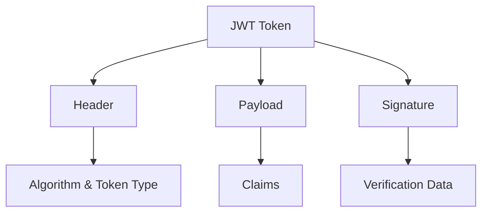
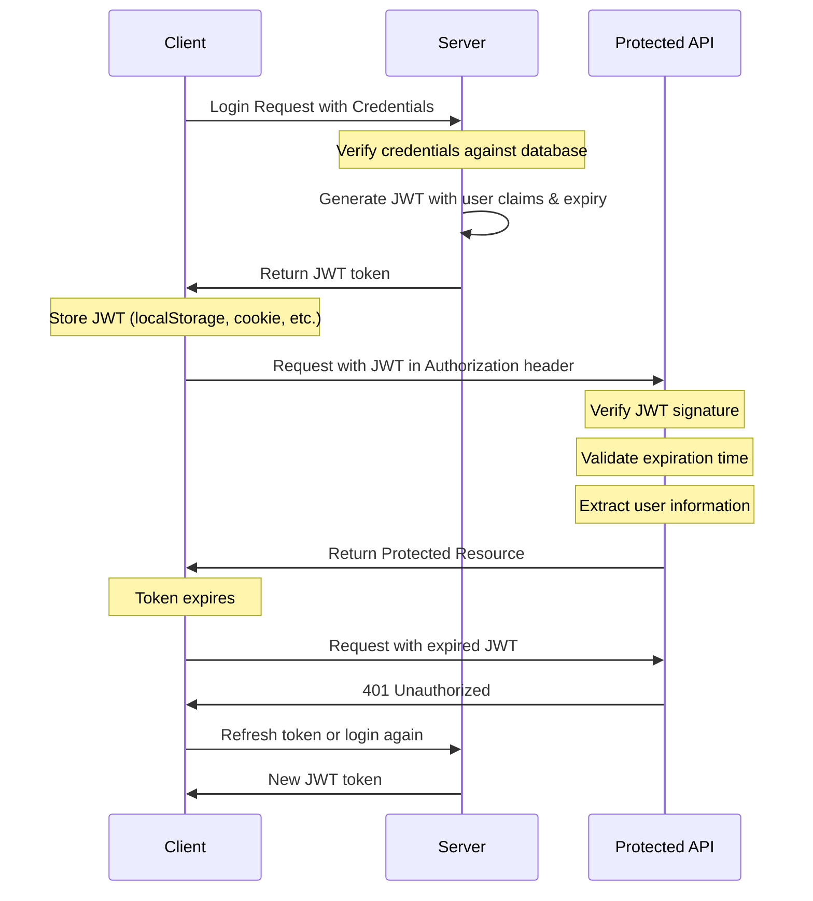
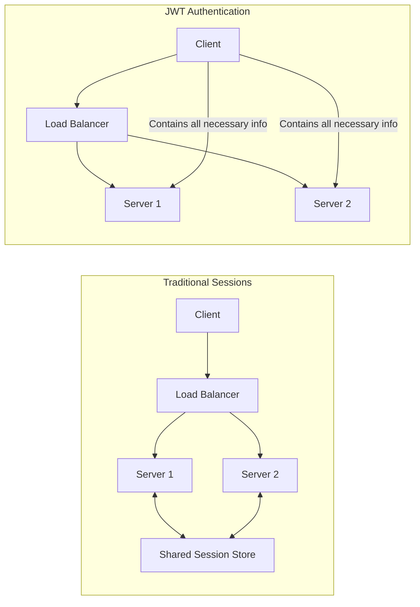

# JWT (JSON Web Token) Guide


## Table of Contents
- [What is a JWT Token?](#what-is-a-jwt-token)
- [JWT Structure](#jwt-structure)
- [JWT Authentication Flow](#jwt-authentication-flow)
- [JWT Functions](#jwt-functions)
- [JWT Statelessness](#jwt-statelessness)
- [Best Practices](#best-practices)
- [Implementation Examples](#implementation-examples)

## What is a JWT Token?

JSON Web Token (JWT) is an open standard ([RFC 7519](https://tools.ietf.org/html/rfc7519)) that defines a compact and self-contained way for securely transmitting information between parties as a JSON object. This information can be verified and trusted because it is digitally signed.

### Key Characteristics of JWT

- **Compact**: JWTs can be sent through URLs, POST parameters, or inside HTTP headers. They are also significantly compact compared to other standards like SAML.

- **Self-contained**: The token itself contains all necessary information about the user, eliminating the need to query the database more than once.

- **Digitally Signed**: JWTs can be signed using a secret (HMAC algorithm) or a public/private key pair (RSA or ECDSA).

### Common Use Cases

- **Authentication**: The most common use case for JWT. Once a user logs in, each subsequent request will include the JWT, allowing the user to access routes, services, and resources permitted with that token.

- **Information Exchange**: JWTs are a good way of securely transmitting information between parties because they can be signed, ensuring the sender is who they say they are.

- **Authorization**: Once a user is logged in, an application can allow access to specific routes or resources based on the claims within the JWT.

## JWT Structure

A JWT consists of three parts separated by dots (`.`):

```
xxxxx.yyyyy.zzzzz
```

These three parts are:

1. **Header**
2. **Payload**
3. **Signature**



### Header

The header typically consists of two parts:
- The type of token (JWT)
- The signing algorithm being used (HMAC SHA256, RSA, etc.)

Example:
```json
{
  "alg": "HS256",
  "typ": "JWT"
}
```

This JSON is Base64Url encoded to form the first part of the JWT.

### Payload

The payload contains the claims. Claims are statements about an entity (typically, the user) and additional data.

There are three types of claims:

1. **Registered claims**: Predefined claims which are not mandatory but recommended, such as:
   - `iss` (issuer)
   - `exp` (expiration time)
   - `sub` (subject)
   - `aud` (audience)
   - `iat` (issued at time)

2. **Public claims**: These can be defined at will by those using JWTs.

3. **Private claims**: Custom claims created to share information between parties that agree on using them.

Example:
```json
{
  "sub": "1234567890",
  "name": "John Doe",
  "admin": true,
  "iat": 1516239022,
  "exp": 1516242622
}
```

This JSON is Base64Url encoded to form the second part of the JWT.

### Signature

The signature is created by taking the encoded header, the encoded payload, a secret, and the algorithm specified in the header, and then signing that.

Example (using HMAC SHA256):
```
HMACSHA256(
  base64UrlEncode(header) + "." +
  base64UrlEncode(payload),
  secret
)
```

The signature is used to verify that the message wasn't changed along the way, and, in the case of tokens signed with a private key, it can also verify that the sender of the JWT is who it says it is.

### Visual Representation of JWT Structure

```
┌───────────────────┐  ┌─────────────────────────┐  ┌───────────────────────────────┐
│      Header       │  │        Payload          │  │          Signature            │
│  {                │  │  {                      │  │                               │
│    "alg": "HS256",│  │    "sub": "1234567890", │  │  HMACSHA256(                  │
│    "typ": "JWT"   │  │    "name": "John Doe",  │  │    base64UrlEncode(header) +  │
│  }                │  │    "admin": true,       │  │    "." +                      │
│                   │  │    "iat": 1516239022,   │  │    base64UrlEncode(payload),  │
│                   │  │    "exp": 1516242622    │  │    secret)                    │
│                   │  │  }                      │  │                               │
└───────────────────┘  └─────────────────────────┘  └───────────────────────────────┘
           ▲                       ▲                              ▲
           │                       │                              │
           │                       │                              │
           └───────────────────────┼──────────────────────────────┘
                                   │
                                   │
                                   ▼
             eyJhbGciOiJIUzI1NiIsInR5cCI6IkpXVCJ9.
             eyJzdWIiOiIxMjM0NTY3ODkwIiwibmFtZSI6IkpvaG4gRG9lIiwiYWRtaW4iOnRydWUsImlhdCI6MTUxNjIzOTAyMiwiZXhwIjoxNTE2MjQyNjIyfQ.
             SflKxwRJSMeKKF2QT4fwpMeJf36POk6yJV_adQssw5c
```

## JWT Authentication Flow

JWT-based authentication follows a specific flow to authenticate users and subsequently authorize their access to protected resources.



### Detailed Authentication Flow

1. **User Login**:
   - Client sends credentials (username/password) to the server
   - Server verifies credentials against the database
   - If valid, server generates a JWT with user claims and expiration time
   - Server signs the JWT with a secret key or private key
   - Server returns the JWT to the client

2. **Token Storage on Client**:
   - Client stores the JWT (typically in localStorage, sessionStorage, or HttpOnly cookie)
   - The JWT will be included in subsequent requests

3. **Accessing Protected Resources**:
   - Client includes the JWT in the Authorization header of the request
   ```
   Authorization: Bearer <token>
   ```
   - Server verifies the signature of the JWT
   - Server checks if the token has expired
   - Server extracts user information from the payload
   - If valid, server processes the request and returns the protected resource

4. **Token Expiration**:
   - When the token expires, protected API returns 401 Unauthorized
   - Client either redirects to login page or uses refresh token mechanism

5. **Token Refresh (Optional)**:
   - Client sends a refresh token to obtain a new access token
   - Server verifies the refresh token
   - Server generates a new JWT and returns it to the client

## JWT Functions

JWTs serve several important functions in modern web applications:

### 1. Authentication

When a user logs in, a JWT is issued and must be included in subsequent requests. The server verifies the token's signature to ensure it was created by a trusted source.

### 2. Authorization

JWTs can contain roles or permissions in the payload, allowing servers to make authorization decisions without additional database lookups.

```json
{
  "sub": "1234567890",
  "name": "John Doe",
  "roles": ["admin", "editor"],
  "permissions": ["read:users", "write:posts"]
}
```

### 3. Information Exchange

JWTs can securely transmit information between parties because they are signed, ensuring the information hasn't been tampered with.

### 4. Single Sign-On (SSO)

JWTs enable Single Sign-On across multiple domains or services. Once authenticated with one service, the JWT can be used to access other services without requiring the user to log in again.

### 5. Mobile Authentication

JWTs are compact and can be easily transmitted in HTTP headers, making them ideal for mobile applications where bandwidth might be a concern.

## JWT Statelessness

One of the most significant advantages of JWTs is their statelessness. Traditional session-based authentication requires the server to store session data, but JWT-based authentication doesn't require server-side storage.

### Benefits of Statelessness

1. **Scalability**: Since the server doesn't need to store session information, it's easier to scale horizontally.

2. **Cross-domain/Cross-service**: JWTs can be used across different domains or services without requiring shared session stores.

3. **Performance**: No database lookups are needed to verify the user on each request.

4. **Decentralized/Distributed Systems**: Perfect for microservices architecture where services need to communicate securely.



### Challenges of Statelessness

1. **Token Revocation**: Since JWTs are stateless, it's challenging to revoke a token before its expiration.

2. **Token Size**: JWTs can be larger than session IDs, increasing the bandwidth usage.

3. **Secret Management**: The secret used to sign tokens must be securely managed.

4. **Data Staleness**: If user data changes, the JWT will still contain the old data until it expires.

## Best Practices

### Security

1. **Use HTTPS**: Always transmit JWTs over HTTPS to prevent token theft via network eavesdropping.

2. **Set Appropriate Expiration**: Short-lived tokens (minutes to hours) limit the damage if a token is compromised.

3. **Minimize Sensitive Data**: Don't store sensitive information in the payload as it's base64-encoded, not encrypted.

4. **Use Strong Signing Keys**: Use strong, unique secrets for HMAC or robust key pairs for RSA/ECDSA.

5. **Implement Token Refresh**: Use refresh tokens to get new access tokens without requiring user credentials.

### Implementation

1. **Validate All Claims**: Always validate the issuer, audience, expiration, and other claims.

2. **Use Libraries**: Use established JWT libraries rather than implementing JWT handling from scratch.

3. **Handle Errors Gracefully**: Provide clear error messages when token validation fails.

4. **Consider Token Storage**: Store tokens securely (HttpOnly cookies for web applications).

5. **Implement Logout**: Consider maintaining a blacklist of invalidated tokens for important applications.

## Implementation Examples

### Node.js with jsonwebtoken

```javascript
const jwt = require('jsonwebtoken');
const express = require('express');
const app = express();

app.use(express.json());

// Secret key (in production, store this securely)
const SECRET_KEY = 'your-secret-key';

// Login endpoint
app.post('/login', (req, res) => {
  const { username, password } = req.body;
  
  // Verify credentials (simplified)
  if (username === 'admin' && password === 'password') {
    // Create payload
    const payload = {
      sub: '1234567890',
      name: username,
      roles: ['admin'],
      iat: Math.floor(Date.now() / 1000),
      exp: Math.floor(Date.now() / 1000) + (60 * 60) // 1 hour
    };
    
    // Sign the token
    const token = jwt.sign(payload, SECRET_KEY);
    
    // Return the token
    res.json({ token });
  } else {
    res.status(401).json({ error: 'Invalid credentials' });
  }
});

// Middleware to verify token
function authenticateToken(req, res, next) {
  const authHeader = req.headers['authorization'];
  const token = authHeader && authHeader.split(' ')[1];
  
  if (!token) {
    return res.status(401).json({ error: 'No token provided' });
  }
  
  jwt.verify(token, SECRET_KEY, (err, decoded) => {
    if (err) {
      return res.status(403).json({ error: 'Invalid token' });
    }
    
    req.user = decoded;
    next();
  });
}

// Protected endpoint
app.get('/protected', authenticateToken, (req, res) => {
  res.json({ 
    message: 'Protected data', 
    user: req.user 
  });
});

app.listen(3000, () => {
  console.log('Server running on port 3000');
});
```

### Client-side Implementation (JavaScript)

```javascript
// Login function
async function login(username, password) {
  try {
    const response = await fetch('/login', {
      method: 'POST',
      headers: {
        'Content-Type': 'application/json'
      },
      body: JSON.stringify({ username, password })
    });
    
    const data = await response.json();
    
    if (!response.ok) {
      throw new Error(data.error || 'Login failed');
    }
    
    // Store the token
    localStorage.setItem('token', data.token);
    
    return true;
  } catch (error) {
    console.error('Login error:', error);
    return false;
  }
}

// Function to make authenticated requests
async function fetchProtectedData() {
  try {
    const token = localStorage.getItem('token');
    
    if (!token) {
      throw new Error('No token found');
    }
    
    const response = await fetch('/protected', {
      headers: {
        'Authorization': `Bearer ${token}`
      }
    });
    
    const data = await response.json();
    
    if (!response.ok) {
      throw new Error(data.error || 'Request failed');
    }
    
    return data;
  } catch (error) {
    console.error('Error fetching protected data:', error);
    
    // If token is invalid, redirect to login
    if (error.message === 'Invalid token') {
      window.location.href = '/login';
    }
    
    return null;
  }
}

// Logout function
function logout() {
  localStorage.removeItem('token');
  window.location.href = '/login';
}
```

## Additional Resources

- [JWT.io](https://jwt.io/) - Decode, verify and generate JWT
- [RFC 7519](https://tools.ietf.org/html/rfc7519) - JWT Specification
- [OWASP JWT Cheat Sheet](https://cheatsheetseries.owasp.org/cheatsheets/JSON_Web_Token_for_Java_Cheat_Sheet.html)

## Conclusion

JWT provides a powerful, flexible mechanism for authentication and information exchange. Its stateless nature makes it ideal for modern web applications, especially those with a microservices architecture. However, like any technology, it comes with trade-offs that must be understood and managed.

When implemented correctly with proper security considerations, JWT can significantly simplify authentication while maintaining robust security.
